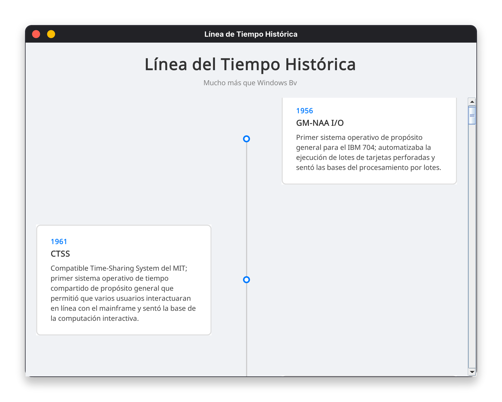

# LineaTiempoOS
Linea del tiempo para sistemas operativos

Es necesario tener datos a mostrar en un CSV como hay en [datos.csv](src/main/resources/datos.csv)

|año|titulo|descripcion|imagen_alt
| --- | --- | --- | --- |
1956|GM-NAA I/O|Primer sistema operativo de propósito general para el IBM 704; automatizaba la ejecución de lotes de tarjetas perforadas y sentó las bases del procesamiento por lotes.|Tarjetas perforadas siendo alimentadas a un IBM 704 en la década de 1950